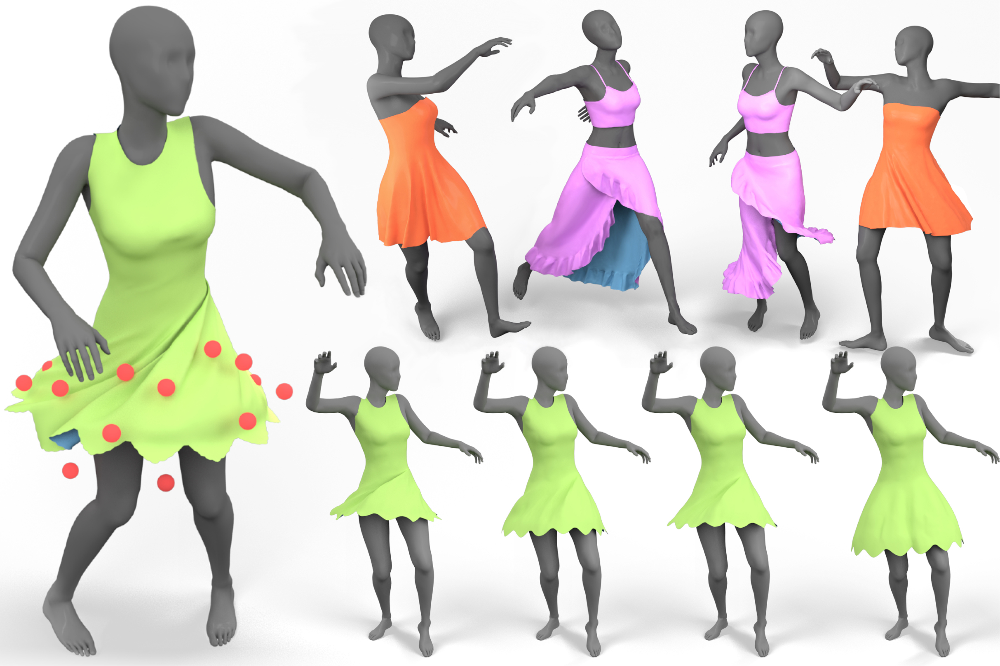

# Predicting Loose-fitting Garment Deformations Using Bone-driven Motion Networks



[[Project website](http://www.cad.zju.edu.cn/home/jin/SigCloth2022/SigCloth2022.htm)][[arXiv](https://arxiv.org/abs/2205.01355)]

## Abstract

> We present a learning algorithm that uses bone-driven motion networks to predict the deformation of loose-fitting garment meshes at interactive rates. Given a garment, we generate a simulation database and extract virtual bones from simulated mesh sequences using skin decomposition. At runtime, we separately compute the low- and high-frequency deformations in a sequential manner. The low-frequency deformations are predicted by transferring body motions to virtual bones' motions, and the high-frequency deformations are estimated leveraging the global information of virtual bones' motions and local information extracted from low-frequency meshes. In addition, our method can estimate garment deformations caused by variations of the simulation parameters (e.g., fabric's bending stiffness) using an RBF kernel ensembling trained networks for different sets of simulation parameters. Through extensive comparisons, we show that our method outperforms state-of-the-art methods in terms of prediction accuracy of mesh deformations by about 20% in RMSE and 10% in Hausdorff distance and STED.

## Project Structure

```
ROOT
├── anim # example animation sequences
├── assets
│ ├── dressX
│ │ ├── checkpoints # trained models, SSDR.pth.tar for low-frequency module 
and SSDRRES.pth.tar for high-frequency module
│ │ └── SSDR # skin weights and rest pose of decomposed garment sequence
│ └── img
├── out # the default folder for outputting obj files
└── src
```

## Running the Model

#### Requirements:

**python** 3.8.10, **pytorch** 1.8.0, **pytorch_geometric** 1.7.0, **numpy** 1.21.3, **scipy** 1.7.1

and **psbody**, you can install it following the instructions on `https://github.com/MPI-IS/mesh`

#### Motion Network

Check out the `run_motionnet.py` to run a single motion network, you can change the garment, animation sequence or other
configs by modifying lines 138-141:

```python
    config_path = "assets/dress03/config.json"
    anim_path = "anim/anim3.npz"
    out_path = "out"
    device = "cpu"
```

#### Simulation Parameter Variations

Check out the `run_sim_param_variation.py` to run a single motion network, you can change the garment, animation sequence or other
configs by modifying lines 209-213:

```python
    config_path = "assets/dress02_sim_params/config.json"
    anim_path = "anim/anim1.npz"
    out_path = "out"
    device = "cuda:0"
    sim_param = np.array([-8.066074945242537, 0.5042348713899382, 0.07167780009477188])
```

Please download the models from [[this link](https://drive.google.com/drive/folders/1VLaAlMne_ulEJpqSmjdqAD7yh8p5mk_7?usp=sharing)] and place the corresponding folder into the assets folder.

For the `sim_param` array, the three values correspond to bending stiffness, time scale and density respectively.


## Dataset

https://drive.google.com/drive/folders/1QOczIuWbKdj4lgpxifuj-C7d7bdoAXk8?usp=sharing

or

https://github.com/sig22virtualbones/VirtualBonesDataset
